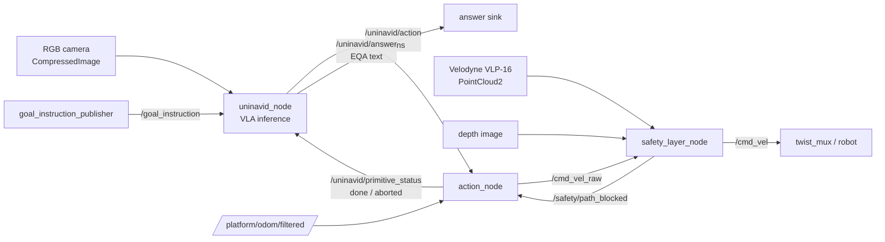

# Uni-NaVid ROS 2 Navigation Stack

A modular **ROS 2 (Humble)** stack that deploys the [Uni-NaVid](https://github.com/jzhzhang/Uni-NaVid) video-based Vision-Language-Action (VLA) model on a **Clearpath Husky** robot. The model takes an egocentric RGB stream and a natural-language instruction and drives the robot end-to-end, supporting all four Uni-NaVid tasks: **VLN, ObjectNav, EQA, and Human Following**.

Inference runs on an external GPU workstation; only `/cmd_vel` is sent to the robot.

> Replace the placeholders marked `<...>` (repo URL, author, license) before publishing.

---

## Table of Contents

- [Overview](#overview)
- [Architecture](#architecture)
- [Supported Tasks](#supported-tasks)
- [Requirements](#requirements)
- [Installation](#installation)
- [Model Weights](#model-weights)
- [Build](#build)
- [Usage](#usage)
- [Topics](#topics)
- [Configuration](#configuration)
- [How It Works](#how-it-works)
- [Safety Layer](#safety-layer)
- [Troubleshooting](#troubleshooting)
- [Citation](#citation)
- [Acknowledgments](#acknowledgments)
- [License](#license)

---

## Overview

The stack wraps Uni-NaVid behind a clean ROS 2 interface and splits responsibilities across four nodes so that perception, decision-making, motion execution, and collision safety stay decoupled and independently testable:

- **`uninavid_node`** — runs the VLA model, turns instructions + video into discrete actions.
- **`action_node`** — executes each discrete action as a closed-loop motion primitive on odometry.
- **`safety_layer_node`** — a velocity guard that brakes/aborts on predicted collisions using the Velodyne point cloud.
- **`goal_instruction_publisher`** — a small terminal tool to send goals by hand.

Design highlights:

- **Execute-first, step-synchronous loop** — faithful to Uni-NaVid's online video-streaming behaviour: one inference per executed step, video memory kept dense.
- **Fixed canonical primitives** — `25 cm` forward, `30°` rotation (as defined in the paper).
- **Persistent video memory across goals** — a new instruction does *not* wipe the model's internal memory; only an explicit reset does.
- **Predictive safety** — the safety layer forward-simulates the command against a 2D occupancy/height map and aborts forward primitives so the VLA re-plans (deviation via re-planning, not via steering).

---

## Architecture



### Nodes

| Node | Role |
| --- | --- |
| `uninavid_node` | Loads Uni-NaVid, formats the instruction per task, runs inference (one step at a time), publishes action tokens, and produces text answers in EQA. Subclass of a reusable `VLABaseNode`. |
| `action_node` | Maps each token to a fixed-magnitude primitive and executes it closed-loop on odometry, emitting `done`/`aborted`. Aborts forward primitives on `path_blocked`. |
| `safety_layer_node` | Velocity filter `/cmd_vel_raw → /cmd_vel`. Builds a 2D occupancy/height map from the point cloud, runs a predictive footprint sweep, scales velocity, and raises `path_blocked`. |
| `goal_instruction_publisher` | Reads goals from stdin and publishes them on `/goal_instruction`. |

`VLABaseNode` is a generic, model-agnostic base (template-method pattern) that holds the ROS I/O, QoS, threaded model loading, and the step-synchronous loop. `uninavid_node` overrides only the model-specific hooks (`load_model`, `infer_action`, `_on_stop`, parameter declaration). The same base can host other VLA models (e.g. NaVILA).

---

## Supported Tasks

Uni-NaVid distinguishes tasks **purely through the instruction text** — there is no task flag fed to the model. The node applies the right wording based on the `task` parameter:

| `task` | Goal you publish | Instruction sent to the model | Stop behaviour |
| --- | --- | --- | --- |
| `vln` | full route instruction | passed verbatim | goal complete |
| `objectnav` | object name (e.g. `a sofa`) | `Search for a sofa.` | goal complete |
| `eqa` | the question | passed verbatim | navigate → stop → **answer** on `/uninavid/answer` |
| `following` | person description | `Follow the man in the blue t-shirt.` | continuous — stop is not final, tracking resumes |

Actions: `forward` (25 cm), `left` / `right` (30°), `stop`. The model predicts four actions per inference; only the first is executed before re-observing (see [How It Works](#how-it-works)).

---

## Requirements

**Software**
- ROS 2 Humble
- Python 3.10
- CUDA 11.8 (x86_64) with a GPU capable of running a 7B VLA (≈ A100-class for full speed; runs slower on smaller GPUs)
- Docker (recommended — the inference environment is containerised)
- Cyclone DDS (recommended RMW)

**Hardware (reference platform)**
- Clearpath Husky
- ZED stereo camera (RGB + depth)
- Velodyne VLP-16 LiDAR
- External GPU workstation for inference (only `/cmd_vel` goes to the robot)

---

## Installation

Clone with the Uni-NaVid source vendored under `third_party/`:

```bash
git clone --recursive <YOUR_REPO_URL>
cd <package_name>
```

The model code lives at `uni_navid/third_party/Uni-NaVid/` and is installed without its full training stack:

```bash
pip install --no-deps -e uni_navid/third_party/Uni-NaVid
```

> A `numpy<2` constraint is required to avoid ABI conflicts between `cv_bridge` / `pyzed` and the inference container. Build the inference container from the provided `Dockerfile` (x86 / CUDA 11.8) for a reproducible environment.

---

## Model Weights

Weights are downloaded automatically on first launch by `uninavid_node` (`ensure_model`), so no manual step is strictly required. The node:

1. Pulls the Uni-NaVid checkpoint from Hugging Face (`Jzzhang/Uni-NaVid`) into `model_path`.
2. Downloads the **EVA-ViT-G** encoder and symlinks it where the model code expects it (`model_zoo/eva_vit_g.pth`).

Set the relevant environment variables (mount points) before launch:

```bash
export UNINAVID_MODEL_PATH=/models          # weights live here
export UNINAVID_REPO_DIR=/path/to/Uni-NaVid # for the encoder symlink
```

The `model_path` parameter should point at the `uni-navid` checkpoint directory (default `$UNINAVID_MODEL_PATH/uni-navid`).

---

## Build

```bash
cd <ros2_ws>
colcon build --packages-select <package_name>
source install/setup.bash
```

---

## Usage

### 1. Launch the stack

```bash
ros2 launch <package_name> uni_navid.launch.py \
    use_sim_time:=false \
    enable_safety:=true
```

The launch file routes `action_node`'s output based on `enable_safety`:
- safety **on** → `action_node` publishes to `/cmd_vel_raw`, the safety layer filters to `/cmd_vel`
- safety **off** → `action_node` publishes directly to `/cmd_vel`

Parameters are loaded from a YAML profile (see [Configuration](#configuration)).

### 2. Send a goal

Use the terminal publisher:

```bash
ros2 run <package_name> goal_instruction_publisher
Goal > go down the corridor and stop near the second door on the right
```

or publish directly:

```bash
ros2 topic pub --once /goal_instruction std_msgs/String "{data: 'a chair'}"
```

### 3. Per-task examples

```bash
# VLN  (task: vln)
Goal > walk past the kitchen and stop at the end of the hallway

# ObjectNav  (task: objectnav)  — publish just the object
Goal > a potted plant

# EQA  (task: eqa)  — answer appears on /uninavid/answer
Goal > what colour is the sofa in the living room?
ros2 topic echo /uninavid/answer

# Following  (task: following)  — publish the description
Goal > the person in the red jacket
```

### 4. Reset the model memory

```bash
ros2 topic pub --once /uninavid/reset std_msgs/Empty "{}"
```

---

## Topics

### `uninavid_node`
| Direction | Topic | Type |
| --- | --- | --- |
| sub | `image_topic` (`/.../image_raw/compressed`) | `sensor_msgs/CompressedImage` |
| sub | `/goal_instruction` | `std_msgs/String` |
| sub | `/uninavid/reset` | `std_msgs/Empty` |
| sub | `/uninavid/primitive_status` | `std_msgs/String` |
| pub | `/uninavid/action` | `std_msgs/String` |
| pub | `/uninavid/answer` | `std_msgs/String` |

### `action_node`
| Direction | Topic | Type |
| --- | --- | --- |
| sub | `/uninavid/action` | `std_msgs/String` |
| sub | `/platform/odom/filtered` | `nav_msgs/Odometry` |
| sub | `/safety/path_blocked` | `std_msgs/Bool` |
| pub | `cmd_vel_topic` (`/cmd_vel_raw` or `/cmd_vel`) | `geometry_msgs/Twist` |
| pub | `/uninavid/primitive_status` | `std_msgs/String` |

### `safety_layer_node`
| Direction | Topic | Type |
| --- | --- | --- |
| sub | `/cmd_vel_raw` | `geometry_msgs/Twist` |
| sub | `cloud_topic` (`/velodyne_points`) | `sensor_msgs/PointCloud2` |
| sub | `depth_topic` | `sensor_msgs/Image` |
| pub | `/cmd_vel` | `geometry_msgs/Twist` |
| pub | `/safety/path_blocked` | `std_msgs/Bool` |
| pub | `/safety/occupancy` (optional) | `nav_msgs/OccupancyGrid` |

---

## Configuration

Parameters are provided via YAML profiles, one section per node (the top-level key is the **node name**, not the file/class). Inherited parameters (from `VLABaseNode`) and node-specific ones share the same namespace.

Example profiles:
- `config/sim_uninavid_config.yaml` — simulation (`use_sim_time: true`)
- `config/real_uninavid_config.yaml` — real robot

Key parameters:

| Node | Parameter | Default | Meaning |
| --- | --- | --- | --- |
| `uninavid_node` | `task` | `vln` | `vln` / `objectnav` / `eqa` / `following` |
| `uninavid_node` | `model_path` | `$UNINAVID_MODEL_PATH/uni-navid` | checkpoint dir |
| `action_node` | `forward_step_m` | `0.25` | fixed forward step (m) |
| `action_node` | `turn_step_deg` | `30.0` | fixed turn step (deg) |
| `action_node` | `linear_x` / `angular_z` | `0.4` / `0.35` | execution speeds |
| `safety_layer_node` | `cloud_topic` | `/velodyne_points` | **PointCloud2** input |
| `safety_layer_node` | `base_frame` | `base_link` | TF target for the cloud |
| `safety_layer_node` | `front_stop_dist` / `front_slow_dist` | `1.2` / `1.5` | braking thresholds (m) |
| `safety_layer_node` | `robot_half_length` / `robot_half_width` | `0.50` / `0.34` | footprint (Husky) |
| `safety_layer_node` | `predict_horizon_sec` | `2.0` | predictive sweep horizon |

> `path_blocked_topic` must be identical in `action_node` and `safety_layer_node`. `use_sim_time` can be shared across all nodes under a `/**:` block.

---

## How It Works

**Step-synchronous execution.** `uninavid_node` runs one inference, takes the **first** of the four predicted actions, and publishes it. `action_node` executes that single primitive as a closed-loop motion on odometry and reports `done` (or `aborted`). Only then does `uninavid_node` grab a fresh frame and infer again. This keeps the model's video memory advancing in lockstep with the robot — one observation per executed step — exactly as in the original online evaluation. The other three predicted actions act as a short-horizon hint and are intentionally discarded (receding-horizon control).

**Persistent memory.** Uni-NaVid keeps its temporal memory internally (an online token-merge feature cache), so the node feeds a single frame per call. A new goal updates the instruction *without* resetting that memory, enabling mixed long-horizon tasks. The memory is cleared only on `/uninavid/reset`.

**EQA two phases.** During EQA the model navigates with action tokens; when it emits `stop`, the node switches to an answering prompt, generates free text from the accumulated video, and publishes it on `/uninavid/answer` instead of forwarding it as a motion command.

---

## Safety Layer

The safety layer is a pure velocity guard — it can brake/abort but never steers, so it does not contaminate the VLA's navigation behaviour.

Pipeline: **PointCloud2 → `base_link` (TF) → height-band ground removal → 2D occupancy grid → per-sector minimum distances + predictive footprint sweep**.

- **Velocity scaling** uses the same `front_stop` / `front_slow` thresholds and formula as a classic reactive guard, but the distance comes from the richer occupancy map (catches low/overhanging obstacles and side obstacles during turns that a single LaserScan ring misses).
- **Predictive footprint sweep** forward-simulates the current command and checks the swept robot footprint against occupied cells. On a predicted hard collision it raises `/safety/path_blocked`.
- `action_node` aborts the current **forward** primitive on `path_blocked`, which makes `uninavid_node` re-observe and re-plan — so the robot deviates *by re-planning*, not by the safety layer overriding heading.

Set `publish_grid: true` to visualise `/safety/occupancy` in RViz.

---

## Troubleshooting

| Symptom | Likely cause |
| --- | --- |
| Robot never moves, goal ignored | Goal published before the model finished loading (volatile QoS). Wait for the `ready` log, or use a latched publisher. |
| Continuous `aborted` / re-inference | Odometry not flowing on `odom_topic` → primitives never reach their target → deadline timeout. |
| Safety layer always stops the robot | `cloud_topic` not a PointCloud2, or missing TF `base_link ← <cloud frame>`. |
| Degraded / nonsensical actions | Wrong colour order — verify frames reaching the model are RGB. |
| `left` turns the robot right | Frame-convention mismatch (Habitat vs REP-103). Verify the turn direction once on the real robot. |
| Node ignores a YAML parameter | Parameter name typo, or it is not declared by that node (undeclared params are silently ignored). |

---

## Citation

This stack deploys the Uni-NaVid model. If you use it, please cite the original work:

```bibtex
@article{zhang2024uni,
    title={Uni-NaVid: A Video-based Vision-Language-Action Model for Unifying Embodied Navigation Tasks},
    author={Zhang, Jiazhao and Wang, Kunyu and Wang, Shaoan and Li, Minghan and Liu, Haoran and Wei, Songlin and Wang, Zhongyuan and Zhang, Zhizheng and Wang, He},
    journal={Robotics: Science and Systems},
    year={2025}
}
```

---

## Acknowledgments

- [Uni-NaVid](https://github.com/jzhzhang/Uni-NaVid) by Zhang et al. (RSS 2025) — the underlying VLA model.
- Built for a Clearpath Husky with ROS 2 Humble.

---

## License

<Choose a license — e.g. MIT.> Note that the upstream Uni-NaVid code and weights carry their own license terms; review them before redistribution.
