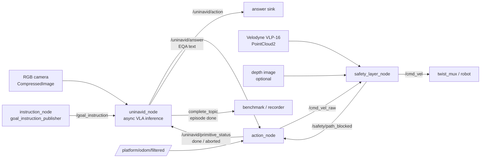

# Uni-NaVid ROS 2 Navigation Stack

A modular **ROS 2 (Humble)** stack that deploys the [Uni-NaVid](https://github.com/jzhzhang/Uni-NaVid) video-based Vision-Language-Action (VLA) model on a **Clearpath Husky**. The model consumes an egocentric RGB stream plus a natural-language instruction and drives the robot end-to-end across all four Uni-NaVid tasks: **VLN, ObjectNav, EQA, Human Following**.

Inference runs on an external GPU workstation; only `/cmd_vel` reaches the robot.

> Replace the placeholders marked `<...>` (repo URL, author, license) before publishing.

---

## Table of Contents

- [Overview](#overview)
- [Architecture](#architecture)
- [Supported Tasks](#supported-tasks)
- [Requirements](#requirements)
- [Installation](#installation)
- [Model Weights](#model-weights)
- [Build](#build)
- [Usage](#usage)
- [Topics](#topics)
- [Configuration](#configuration)
- [How It Works](#how-it-works)
- [Goal Rewriting (Ollama)](#goal-rewriting-ollama)
- [Safety Layer](#safety-layer)
- [Repository Layout](#repository-layout)
- [Troubleshooting](#troubleshooting)
- [Citation](#citation)
- [Acknowledgments](#acknowledgments)
- [License](#license)

---

## Overview

The stack wraps Uni-NaVid behind a clean ROS 2 interface and splits responsibilities across four nodes so that perception, decision-making, motion execution and collision safety stay decoupled and independently testable:

- **`uninavid_node`** — runs the VLA model; turns instruction + video into discrete navigation primitives, using an **asynchronous pipelined** inference loop.
- **`action_node`** — executes each discrete primitive as a closed-loop, fixed-magnitude motion on odometry.
- **`safety_layer_node`** — a velocity guard that brakes/aborts on predicted collisions using the Velodyne point cloud (optional, off by default).
- **`instruction_node`** (`goal_instruction_publisher`) — a terminal tool to send goals by hand, optionally rewriting them through a local Ollama LLM.

Design highlights:

- **Asynchronous chunk pipeline** — inference and execution overlap: while the current action runs, the next inference is already in flight in a background thread (Uni-NaVid emits a chunk of ~4 actions per pass, paper Sec. IV).
- **Fixed canonical primitives** — `25 cm` forward, `30°` rotation (paper definition).
- **Persistent video memory across goals** — a new instruction does *not* wipe the model's internal memory; only an explicit reset does.
- **1:1 handshake** — exactly one action published per `primitive_status` (`done`/`aborted`) round-trip, and exactly one inference touching the video memory at a time.
- **Predictive safety by re-planning** — the safety layer aborts forward primitives so the VLA re-plans from the new frame; it never steers.

> **Changed from the previous README:** the loop is no longer *step-synchronous* ("one inference per executed step, discard the other three actions"). It is now an *async chunk pipeline* that adopts/drains chunks — see [How It Works](#how-it-works). The former `VLABaseNode` template class has been merged into a single self-contained `UniNaVidNode`.

---

## Architecture



With `safety:=false` (default), `action_node` publishes directly to `/cmd_vel` and `safety_layer_node` is not started.

### Nodes

| Node | Role |
| --- | --- |
| `uninavid_node` | Loads Uni-NaVid, formats the instruction per task, runs inference in a background thread, publishes one action per handshake, and produces text answers in EQA. |
| `action_node` | Maps each action to a fixed-magnitude primitive and executes it closed-loop on odometry, emitting `done`/`aborted`. Aborts a forward primitive on `path_blocked`. |
| `safety_layer_node` | Velocity filter `/cmd_vel_raw → /cmd_vel`. Builds a 2D occupancy/height map from the point cloud, runs a predictive footprint sweep, scales velocity and raises `path_blocked`. |
| `instruction_node` | Reads goals from stdin, optionally rewrites them via Ollama, publishes on `/goal_instruction`. |

---

## Supported Tasks

Uni-NaVid distinguishes tasks **purely through the instruction text** — there is no task flag fed to the model. `uninavid_node` applies the correct wording based on the `task` parameter (`_format_instruction`):

| `task` | Goal you publish | Instruction sent to the model | Stop behaviour (`_on_stop`) |
| --- | --- | --- | --- |
| `vln` | full route instruction | passed verbatim | terminal → clear goal, publish `complete` |
| `objectnav` | object name (e.g. `a sofa`) | `Search for a sofa.` | terminal → clear goal, publish `complete` |
| `eqa` | the question | passed verbatim | `stop` triggers the answer phase (`agent.answer`) → publish `answer` → clear goal → publish `complete` |
| `following` | person description | `Follow the person in the red jacket.` | **not** terminal → goal kept, inference re-arms to keep tracking |

Actions: `forward` (25 cm), `left`/`turn_left` (+30°), `right`/`turn_right` (−30°), `stop`.

---

## Requirements

**Software**
- ROS 2 Humble
- Python 3.10
- CUDA 11.8 (x86_64) with a GPU able to run a 7B VLA (≈ A100-class for full speed; slower on smaller GPUs)
- Docker (recommended — the inference environment is containerised)
- Cyclone DDS (recommended RMW)
- Ollama (optional, only for `instruction_node` goal rewriting)

**Hardware (reference platform)**
- Clearpath Husky
- ZED stereo camera (RGB + depth)
- Velodyne VLP-16 LiDAR
- External GPU workstation for inference (only `/cmd_vel` goes to the robot)

---

## Installation

Clone with the Uni-NaVid source vendored under `third_party/`:

```bash
git clone --recursive <YOUR_REPO_URL>
cd uni_navid
```

The model code lives at `third_party/UniNaVid/` and is installed without its full training stack:

```bash
pip install --no-deps -e third_party/UniNaVid
```

> A `numpy<2` constraint is required to avoid ABI conflicts between `cv_bridge` / `pyzed` and the inference container. Build the inference container from the provided `Dockerfile` (x86 / CUDA 11.8) for a reproducible environment.

Set the mount-point environment variables before launch (used by `uninavid_node.ensure_model`):

```bash
export UNINAVID_MODEL_PATH=/models            # weights live here
export UNINAVID_REPO_DIR=/path/to/vendored    # dir that contains UniNaVid/ (for the encoder symlink)
```

`model_path` defaults to `$UNINAVID_MODEL_PATH/uni_navid_model`.

---

## Model Weights

Weights are downloaded automatically on first launch by `uninavid_node` (`ensure_model`), so no manual step is strictly required. The node:

1. Pulls the Uni-NaVid checkpoint from Hugging Face (`Jzzhang/Uni-NaVid`) into `model_path`.
2. Downloads the **EVA-ViT-G** encoder to `$UNINAVID_MODEL_PATH/eva_vit_g.pth` and symlinks it where the model code expects it (`$UNINAVID_REPO_DIR/UniNaVid/model_zoo/eva_vit_g.pth`).

---

## Build

```bash
cd <ros2_ws>
colcon build --packages-select uni_navid
source install/setup.bash
```

---

## Usage

### 1. Launch the stack

Simulation profile (`sim_uninavid.yaml`, `use_sim_time: true`):

```bash
ros2 launch uni_navid simuninavid.launch.py safety:=true
```

Real-robot / test profile (`test_uninavid.yaml`, `use_sim_time: false`), with `task` overridable at launch:

```bash
ros2 launch uni_navid testuninavid.launch.py safety:=true task:=eqa
```

Launch arguments:

| Arg | Default | Effect |
| --- | --- | --- |
| `safety` | `false` | `true` → start `safety_layer_node`; `action_node` → `/cmd_vel_raw` → safety → `/cmd_vel`. `false` → `action_node` → `/cmd_vel` directly. |
| `task` | `vln` | *(test launch only)* overrides the model task: `vln` / `objectnav` / `eqa` / `following`. The sim launch takes `task` from the YAML. |

Both launch files also include `husky_navigation`'s `pointcloud_to_laserscan.launch.py` and start `instruction_node` in an `xterm`, and delay `uninavid_node` by 2 s (`TimerAction`) so the pipeline is up first.

### 2. Send a goal

Terminal publisher (started by the launch file, or run standalone):

```bash
ros2 run uni_navid instruction_node
Goal > go down the corridor and stop near the second door on the right
```

or publish directly:

```bash
ros2 topic pub --once /goal_instruction std_msgs/String "{data: 'a chair'}"
```

### 3. Per-task examples

```bash
# VLN
Goal > walk past the kitchen and stop at the end of the hallway

# ObjectNav — publish just the object
Goal > a potted plant

# EQA — answer appears on /uninavid/answer
Goal > what colour is the sofa in the living room?
ros2 topic echo /uninavid/answer

# Following — publish the description
Goal > the person in the red jacket
```

### 4. Reset the model memory

```bash
ros2 topic pub --once /uninavid/reset std_msgs/Empty "{}"
```

---

## Topics

### `uninavid_node`
| Direction | Parameter (default) | Type |
| --- | --- | --- |
| sub | `image_topic` (`/sensors/front_camera/color/image_raw/compressed`) | `sensor_msgs/CompressedImage` |
| sub | `goal_topic` (`/goal_instruction`) | `std_msgs/String` |
| sub | `reset_topic` (`/uninavid/reset`) | `std_msgs/Empty` |
| sub | `status_topic` (`/uninavid/primitive_status`) | `std_msgs/String` |
| pub | `action_topic` (`/uninavid/action`) | `std_msgs/String` |
| pub | `answer_topic` (`/uninavid/answer`) | `std_msgs/String` |
| pub | `complete_topic` (`/uninavid/complete`) | `std_msgs/String` — payload `"stop"` |

> **Note (code vs docstring):** the module docstring advertises `complete` as a `std_msgs/Bool True`, but the implementation publishes a `std_msgs/String` with `data="stop"`. Both shipped profiles also remap `complete_topic` to **`/benchmark/command`** to drive the episode recorder. Align the docstring (and downstream subscribers) with the `String` contract, or switch the publisher to `Bool`, to remove the ambiguity.

QoS: `image_topic` is `BEST_EFFORT / KEEP_LAST(1)` (sensor); `complete_topic` is `RELIABLE / KEEP_LAST(1)` (event).

### `action_node`
| Direction | Parameter (default) | Type |
| --- | --- | --- |
| sub | `action_topic` (`/uninavid/action`) | `std_msgs/String` |
| sub | `odom_topic` (`/platform/odom/filtered`) | `nav_msgs/Odometry` |
| sub | `path_blocked_topic` (`/safety/path_blocked`) | `std_msgs/Bool` |
| pub | `cmd_vel_topic` (`/cmd_vel_raw` or `/cmd_vel`, set by launch) | `geometry_msgs/Twist` |
| pub | `status_topic` (`/uninavid/primitive_status`) | `std_msgs/String` |

### `safety_layer_node`
| Direction | Parameter (default) | Type |
| --- | --- | --- |
| sub | `cmd_in_topic` (`/cmd_vel_raw`) | `geometry_msgs/Twist` |
| sub | `cloud_topic` (`/velodyne_points`) | `sensor_msgs/PointCloud2` |
| sub | `depth_topic` (optional, `enable_depth`) | `sensor_msgs/Image` |
| pub | `cmd_out_topic` (`/cmd_vel`) | `geometry_msgs/Twist` |
| pub | `path_blocked_topic` (`/safety/path_blocked`) | `std_msgs/Bool` |
| pub | `occupancy_topic` (`/safety/occupancy`, if `publish_grid`) | `nav_msgs/OccupancyGrid` |

### `instruction_node`
| Direction | Topic | Type |
| --- | --- | --- |
| pub | `/goal_instruction` | `std_msgs/String` |

---

## Configuration

Parameters are provided via YAML profiles, one section per node (the top-level key is the **node name**). Two profiles ship:

- `config/sim_uninavid.yaml` — simulation (`use_sim_time: true`); `task` set to `vln` in-file.
- `config/test_uninavid.yaml` — real robot (`use_sim_time: false`); `task` intentionally **not** set here (comes from the launch default `vln`, overridable with `task:=...`).

Key parameters:

| Node | Parameter | sim / test | Meaning |
| --- | --- | --- | --- |
| `uninavid_node` | `task` | `vln` / launch | task wording selector |
| `uninavid_node` | `model_path` | `/models/uni_navid_model` | checkpoint dir |
| `uninavid_node` | `frame_rgb` | `false` | `false` = decoded frame is BGR, node converts BGR→RGB before the model |
| `uninavid_node` | `save_debug_frames` / `debug_dir` | `true` / `…/uninavid_debug` | annotated frame dump |
| `action_node` | `forward_step_m` / `turn_step_deg` | `0.25` / `30.0` | fixed primitive magnitudes |
| `action_node` | `linear_x` / `angular_z` | `0.5,0.4` / `0.35` | execution speeds (test starts lower) |
| `safety_layer_node` | `cloud_topic` | `/velodyne_points` | **PointCloud2** input |
| `safety_layer_node` | `base_frame` | `base_link` | TF target for the cloud |
| `safety_layer_node` | `front_stop_dist` / `front_slow_dist` | `1.2,0.9` / `1.5,1.2` | braking thresholds (m) — tighter on real robot |
| `safety_layer_node` | `robot_half_length` / `robot_half_width` | `0.50` / `0.34` | Husky footprint |
| `safety_layer_node` | `cloud_timeout_sec` | `2.5` / `1.0` | no-cloud → STOP |

> `path_blocked_topic` **must** be identical in `action_node` and `safety_layer_node`. `cmd_vel_topic` is *not* set in the YAML — the launch file injects it based on `safety`. Undeclared parameters are silently ignored, so watch for typos.

---

## How It Works

**Asynchronous chunk pipeline.** Inference and execution overlap instead of running in lockstep. Every `act()` call appends the latest frame to the model's persistent video memory and returns a **chunk** of ~4 future actions. The node keeps at most one primitive in flight (`_busy`) and at most one inference touching the video memory (`_infer_running` + `_agent_lock`).

Lifecycle:

1. **New goal** (`_goal_cb`): clear the queue and any pending chunk, then bootstrap inference (`_launch_inference`) — the video memory is **not** reset.
2. **Background inference** (`_inference_worker`): decodes the latest frame, takes `_agent_lock`, runs `infer_action`, and stores the resulting chunk in `_pending_actions`. If the robot is idle it triggers `_advance` immediately.
3. **Action-boundary scheduler** (`_advance`, fired on each `primitive_status`):
   - if a fresh chunk is ready → **adopt** it as the new queue, pop the first action, mark busy, and launch the next inference in parallel (only when adopting, and never right before a `stop`);
   - otherwise → keep **draining** the previous chunk (graceful fallback on slow hardware);
   - if nothing is left → ensure an inference is in flight; the worker restarts `_advance` when it finishes.
4. **Handshake:** `action_node` executes the single primitive closed-loop on odometry and replies `done` or `aborted`. On `aborted` (e.g. safety veto) the current plan is dropped and inference re-plans from the current frame.

**Frame convention.** Images arrive as `CompressedImage`; `cv2.imdecode` yields **BGR**. With `frame_rgb=false` the node converts BGR→RGB inside `infer_action` before the model — the classic colour-channel pitfall lives here, not in the image callback.

**EQA two phases.** During EQA the model navigates with action tokens; when it emits `stop`, `_on_stop` switches to the answering prompt (`agent.answer`), publishes free text on `answer_topic`, then clears the goal and signals `complete`.

**Persistent memory.** Uni-NaVid keeps its temporal memory internally (online token-merge feature cache), so the node feeds one frame per call. A new goal updates the instruction without wiping that memory; only `/uninavid/reset` clears it (`agent.reset()`).

---

## Goal Rewriting (Ollama)

`instruction_node` (`goal_instruction_publisher`) can rewrite raw goals into clean, egocentric, imperative English instructions suited to a VLN-trained VLA, using a **local Ollama** server. It falls back to the raw goal on any failure, so Ollama is optional.

Setup:

```bash
curl -fsSL https://ollama.com/install.sh | sh
ollama serve
ollama pull gemma3:12b     # default model
```

Parameters:

| Parameter | Default | Meaning |
| --- | --- | --- |
| `use_llm` | `true` | set `false` to publish raw goals verbatim |
| `model` | `gemma3:12b` | Ollama model tag |
| `ollama_url` | `http://localhost:11434` | Ollama endpoint |
| `timeout` | `15.0` | request timeout (s) |
| `require_confirmation` | `false` | prompt `[Y/n/e(dit)]` before publishing a rewrite |

```bash
# remote Ollama host
ros2 run uni_navid instruction_node --ros-args -p ollama_url:=http://192.168.x.x:11434
# bypass the LLM
ros2 run uni_navid instruction_node --ros-args -p use_llm:=false
```

---

## Safety Layer

A pure velocity guard — it can brake/abort but never steers, so it does not contaminate the VLA's navigation behaviour.

Pipeline: **PointCloud2 → `base_link` (TF) → height-band ground removal → 2D occupancy/height map → per-sector minimum distances + predictive footprint sweep**.

- **Velocity scaling** from the `front_stop` / `front_slow` thresholds, but the distance comes from the occupancy map, so it catches low/overhanging obstacles and side obstacles during turns that a single LaserScan ring misses.
- **Predictive footprint sweep** forward-simulates the current command against occupied cells; on a predicted hard collision it latches `/safety/path_blocked` after `block_debounce` cycles.
- `action_node` aborts the current **forward** primitive on `path_blocked`, so the robot deviates *by re-planning*, not by the safety layer overriding heading.

Set `publish_grid: true` to visualise `/safety/occupancy` in RViz.

---

## Repository Layout

```
uni_navid/
├── config/
│   ├── sim_uninavid.yaml       # simulation profile (use_sim_time: true)
│   └── test_uninavid.yaml      # real-robot profile (use_sim_time: false)
├── launch/
│   ├── simuninavid.launch.py   # sim profile, no task arg
│   └── testuninavid.launch.py  # test profile, task:= argument
├── uni_navid/
│   ├── uninavid_node.py        # async VLA policy node
│   ├── action_node.py          # closed-loop primitive executor
│   ├── safety_layer_node.py    # predictive velocity guard
│   ├── instruction_node.py     # goal publisher + Ollama rewriter
│   └── __init__.py
├── third_party/
│   ├── uni_navid_agent.py      # UniNaVid_Agent wrapper
│   └── UniNaVid/               # vendored upstream model code
├── resource/uni_navid
├── package.xml
├── setup.py / setup.cfg
└── README.md
```

> **Cleanup note:** the tree still carries a legacy `uni_navid/navid_node.py` from before the `vla_base_node.py` + `navid_node.py` merge into `uninavid_node.py`. If it is no longer an entry point in `setup.py`, remove it (and stale `__pycache__`) to avoid confusion.

---

## Troubleshooting

| Symptom | Likely cause |
| --- | --- |
| Robot never moves, goal ignored | Goal published before the model finished loading. `uninavid_node` waits for the first camera frame **and** a goal before the first inference — check the `Camera frame OK` / `Goal received` logs. |
| Immediate `done` on every primitive, VLA burns inferences in place | Odometry not flowing on `odom_topic`: with no odom `action_node` replies `done` at once. Ensure `/platform/odom/filtered` is live **before** the first goal. |
| Continuous `aborted` / re-inference | Forward primitives timing out (odom stalled) or `path_blocked` latched. |
| Safety layer always stops the robot | `cloud_topic` not a PointCloud2, missing TF `base_link ← <cloud frame>`, or `front_*_dist` too conservative for a small Vicon room — tighten to real clearances. |
| Degraded / nonsensical actions | Wrong colour order — with `frame_rgb=false` the node must convert BGR→RGB; inspect a debug frame (`debug_dir`), correct-looking colours mean `frame_rgb` is set right. |
| `left` turns the robot right | Frame-convention mismatch (Habitat vs REP-103). Verify turn direction once on the real robot. |
| Episode-done signal not received downstream | `complete_topic` publishes a `String "stop"` (not `Bool`) and is remapped to `/benchmark/command` in the profiles — subscribe accordingly. |
| Node ignores a YAML parameter | Parameter name typo, or not declared by that node (undeclared params are silently ignored). |

---

## Citation

```bibtex
@article{zhang2024uni,
    title={Uni-NaVid: A Video-based Vision-Language-Action Model for Unifying Embodied Navigation Tasks},
    author={Zhang, Jiazhao and Wang, Kunyu and Wang, Shaoan and Li, Minghan and Liu, Haoran and Wei, Songlin and Wang, Zhongyuan and Zhang, Zhizheng and Wang, He},
    journal={Robotics: Science and Systems},
    year={2025}
}
```

---

## Acknowledgments

- [Uni-NaVid](https://github.com/jzhzhang/Uni-NaVid) by Zhang et al. (RSS 2025) — the underlying VLA model.
- Built for a Clearpath Husky with ROS 2 Humble.

---

## License

<Choose a license — e.g. MIT.> Note that the upstream Uni-NaVid code and weights carry their own license terms; review them before redistribution.